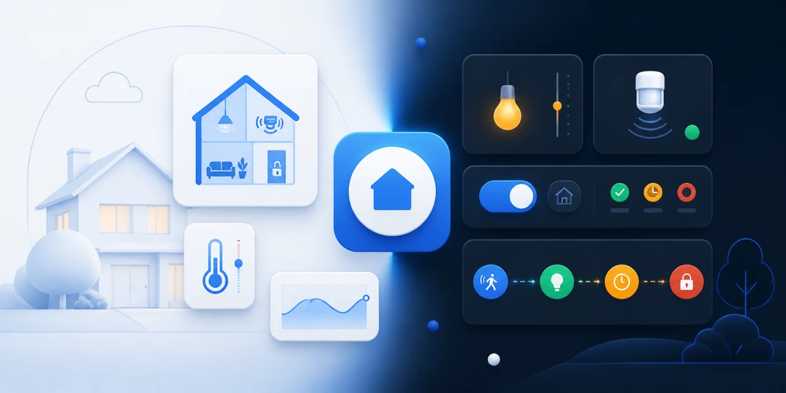

  

# 0libote Home Assistant

Practical Home Assistant blueprints for IKEA Matter devices, plus the clean,
high-readability **Clean Home** light and dark theme.

## Blueprints

| Blueprint | What it does | Requirements | Install |
| --- | --- | --- | --- |
| [IKEA BILRESA Scroll Wheel](blueprints/README.md#ikea-bilresa-scroll-wheel) | Three configurable light presets with wheel dimming, colour cycling and tap/hold actions. | BILRESA connected through Matter; HA 2025.7+ |  |
| [IKEA MYGGSPRAY Smart Motion Lights](blueprints/README.md#ikea-myggspray-smart-motion-lights) | Motion lighting with lux control, previous-profile memory and safe cleanup. | MYGGSPRAY connected through Matter-over-Thread; HA 2025.7+ |  |
| [Forgot to Turn Off](blueprints/README.md#forgot-to-turn-off) | A passive safety net that switches lights off after every selected presence sensor stays clear. | Motion, occupancy or presence sensors; HA 2025.7+ |  |

Importing adds the reusable blueprint to Home Assistant. Afterwards, open
**Settings > Automations & scenes > Blueprints**, select **Create automation**
and choose the entities for your home. See the [blueprint setup guide](blueprints/README.md)
for prerequisites, manual installation and troubleshooting.

## Clean Home theme

Clean Home keeps the native Home Assistant experience while adding automatic
light and dark modes, strong contrast, larger labels and soft rounded controls.
The main theme has no HACS or Card Mod dependency.

- [Installation, dashboard and removal guide](themes/clean-home/README.md)
- [Theme YAML](themes/clean-home/clean-home.yaml)
- [Example dashboard](themes/clean-home/example-dashboard.yaml)

> [!IMPORTANT]
> The theme files are syntax-checked, but Clean Home has not yet completed a
> live Home Assistant smoke test. Treat it as a preview and keep a way to edit
> `/config` before applying it system-wide.

## Updating

- **Blueprints:** open **Settings > Automations & scenes > Blueprints**, use the
  three-dot menu beside a blueprint and select **Re-import blueprint**.
- **Theme:** replace `clean-home.yaml`, reload themes, then refresh the browser
  or companion app. See the [full update steps](themes/clean-home/README.md#update).

## Support

[Open an issue](https://github.com/0libote/HA-BPs/issues/new) with the affected
blueprint or theme, your Home Assistant version, how the device is connected,
and any relevant automation trace or log message. Remove secrets, addresses and
personal entity names before posting.

## Licence

Released under the [MIT Licence](LICENSE).
